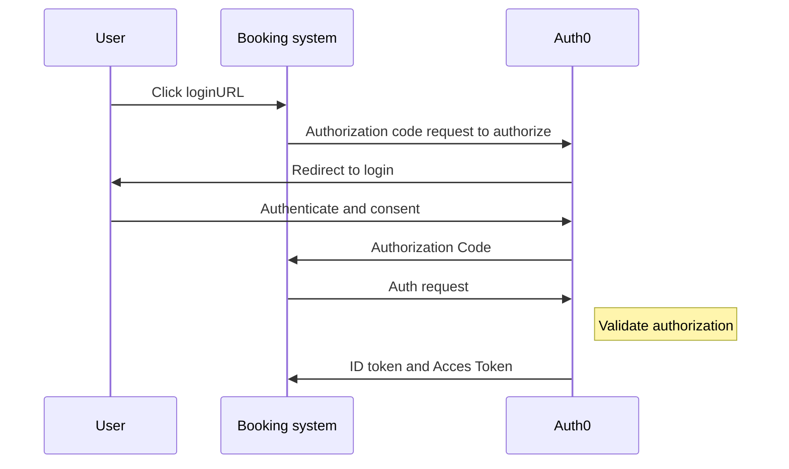
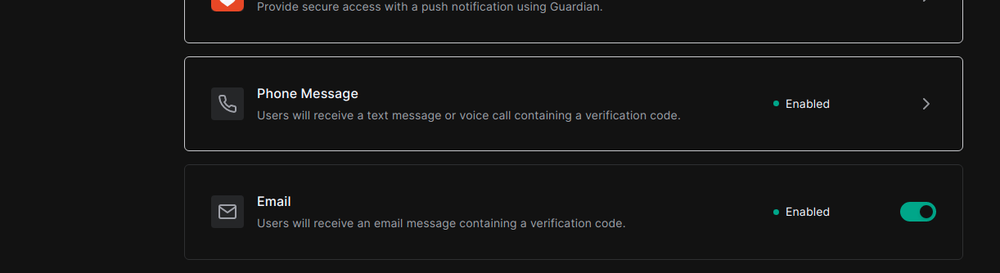
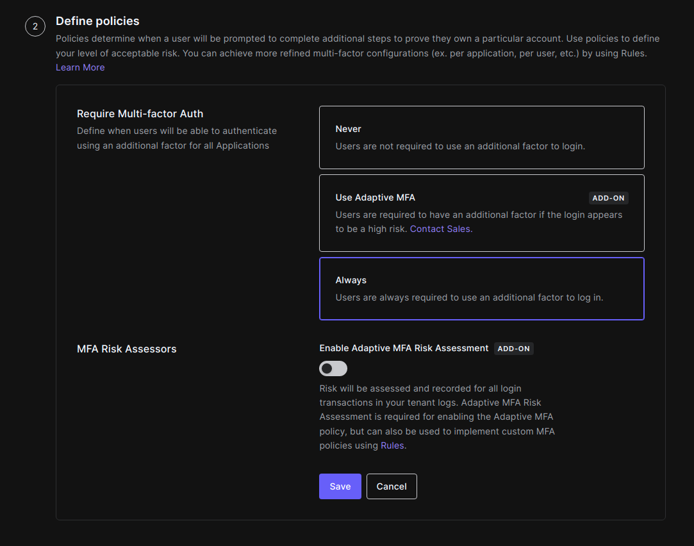

- Start Date: (2022-02-21)

- Members: [Cristian Diaz](https://github.com/ItsCrisDiaz), [Saul Zamora](https://github.com/G-zeus)

- RFC PR: (leave this empty)

# Summary

After evaluate types of **2FA**, it is proposed to implement **Email Token** as a priority over **SMS Token** . In case
of project scope get bigger, **SMS Token** will be a priority too for more security in authentication of users.

# Basic example


### Configure Auth0
First assuming having a Auth0 account we need to configure multi-factor authenticate to enable email token
authentication

1. Go to [Dashboard > Security > Multi-factor Auth.](https://manage.auth0.com/dashboard/us/dev-f8mbeget/security/mfa)
2. In the Factors section need to configurate **Phone message** section because is required to enable the email token
   code

   
3. In the **Define policies** section choose a policy **Always**
   

4. Click **Save**

#### Get application keys
When we signed up for Auth0, a new application was created (or we have create a new one). We will need the following information from the [Application Settings](https://manage.auth0.com/#/applications):
- Domain
- Client ID
### Install the Auth0 React SDK
To install the Auth0 React SDK we run:
```bash
npm install @auth0/auth0-react
```
``The SDK exposes methods and variables that help  integrate Auth0 with  React application idiomatically using`` [React Hooks](https://reactjs.org/docs/hooks-overview.html) ``or`` [Higher-Order Components.](https://reactjs.org/docs/higher-order-components.html)

###Configure the Auth0Provider component

Under the hood, the Auth0 React SDK uses React Context to manage the authentication state of the users. One way to integrate Auth0 with the React app is to wrap the root component with an Auth0Provider that you can import from the SDK.

```js
import React from "react";
import ReactDOM from "react-dom";
import App from "./App";
import { Auth0Provider } from "@auth0/auth0-react";

ReactDOM.render(
  <Auth0Provider
    domain="dev-f8mbeget.us.auth0.com"
    clientId="1Tz54BKj7OJ2auDLk8TScB78zHiXLWAg"
    redirectUri={window.location.origin}
  >
    <App />
  </Auth0Provider>,
  document.getElementById("root")
);
```
The **Auth0Provider** component takes the following props:

- `domain` and `clientId`: The values of these properties correspond to the **"Domain"** and **"Client ID"** values present under the **"Settings"**
- `redirectUri`: The URL to where you'd like to redirect users after they authenticate with Auth0.
  **Auth0Provider** stores the authentication state of your users and the state of the SDK — whether Auth0 is ready to use or not. It also exposes helper methods to log in and log out users, which we can access using the 
```js useAuth0()``` hook.
### Documentation references and implementation

- [How it works](https://auth0.com/docs/get-started/authentication-and-authorization-flow/authorization-code-flow#how-it-works)


- [Customize Email Handling](https://auth0.com/docs/customize/email/manage-email-flow)


- [Enroll and Challenge Email Authenticators](https://auth0.com/docs/secure/multi-factor-authentication/authenticate-using-ropg-flow-with-mfa/enroll-and-challenge-email-authenticators)


- [Multi-Factor Authentication](https://auth0.com/docs/secure/multi-factor-authentication)


- [React: Login](https://auth0.com/docs/quickstart/spa/react/01-login)


- [Multi-factor Authentication Guide](https://auth0.com/blog/multifactor-authentication-mfa/#Step-up-Authentication)

# Motivation

The growth of internet and its systems has required more security for users and his identities, therefore techniques
have been created like 2FA consisting of requiring a user to verify their identity in two unique ways before they are
granted access to the system.

Two Factor Authentication gives the user and system administrator an extra security layer as it ensures that even if the
users password is compromised the account cannot be accessed without also knowing not only the method used as the second
factor but also having access to the second factor such as a dynamically generated.

In this case we sugest implement **Email Token** in this phase of the project because it offers certain advantages over
SMS 2FA like being user friendly and being inexpensive to mantain and setting up.

<!-- # Detailed design

  

This is the bulk of the RFC. Explain the design in enough detail for somebody

familiar with React to understand, and for somebody familiar with the

implementation to implement. This should get into specifics and corner-cases,

and include examples of how the feature is used. Any new terminology should be

defined here. -->

# Drawbacks

Even considering having a reduced scope for the sake of MVP, email 2FA implementation has some disadvantages:

- **Failing of being delivered:** there are some scenarios where e-mails can be failed to be delivered. Events like
  email going to spam, being bounced by server, having a delay in delivery can cause some issues. This could be solved
  with giving enough time to users to add the 2FA code (to mitigate the impact of delay in delivery) and recommending
  users to check for spam folder just in case (to avoid the fact that email going to spam can cause problems).

- **Security:** emails can be intercepted by 3rd parties and tokens compromised.

- **Redundancy:** it's possible that if a 3rd party gains access to user's account, they _can_ gain access to user's
  email as well, and thus easily get the token.

# Alternatives

Another alternative we highly encourage to use if scope can be increased is adding a **SMS 2FA**, it has some advantages
like being user friendly, having a low cost of setup and maintenance, and being widely available.

However, it has some disadvantages we took into consideration to decide we should prioritize email 2FA:

- **Connectivity:** cell signal, reception and country availability are required to receive tokens. This last point is
  important because in the case one of our target countries is not available, it'd harm project's reach.

- **Security:** SMS messages can be intercepted by 3rd parties.

- **Hardware:** physical device required so if phone is lost or stolen the user cannot authenticate.

<!-- # Adoption strategy

  

If we implement this proposal, how will existing C9 developers adopt it? Is

this a breaking change? Can we write a codemod? Should we coordinate with

other projects or libraries? -->


<!-- # How we teach this

  

What names and terminology work best for these concepts and why? How is this

idea best presented? As a continuation of existing C9 projects patterns?

  

Would the acceptance of this proposal mean the C9 documentation must be

re-organized or altered? Does it change how C9 is taught to new developers

at any level?

  

How should this feature be taught to existing C9 developers? -->

# Unresolved questions

- How to implement this feature?

- Which should be the adoption strategy for this feature?

- How should this idea be presented for C9?

- Should we consider a third option for 2FA, like a phone call?
