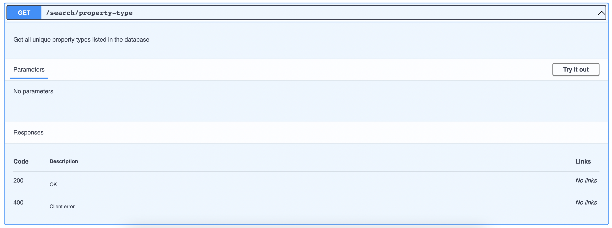

- Start Date: (2022-02-24)
- Members: (Javier Alexander Cañón, Juan Carlos Sarmiento)
- RFC PR: (leave this empty)

# Summary

API contracts in very general terms refer to the documentation of the endpoints that will be available in it and to the detailed way in which users will be able to use the API. Ideally, these contracts should be clear and very specific. to facilitate the use of our application, containing in detail the available endpoints, the response examples and the details of the errors that can be generated.

We believe that the best alternative is to make use of the standards and technologies that currently mark the design of modern APIs, for this case we have investigated and we believe that the best way is to base the work on the OpenAPI standard, relying on the Swagger tool to create the general definition of the API, because in addition to being the current standard supported by the large technology industries, it has a complete and detailed concept that favors the understanding of the operation of our application and its construction.

# Basic example
```JS
  openapi: 3.0.1
  info:
    title: Our-Booking-Api
    description: RESTful API built with node.js
    version: 0.0.1
    license:
      name: MIT
      url: 'https://our-booking-api.info'
  servers:
    - url: 'https://our-booking-api.info'


  paths
  /search/property-type:
      get:
        tags:
          - search
        description: Get all unique property types listed in the database
        responses:
          '200':
            description: OK
          '400':
            description: Client error
        servers:
          - url: 'https://our-booking-api.info'
      servers:
        - url: 'https://our-booking-api.info'
```
# Motivation

A correct and detailed definition of the API will provide a clear overview both for the process of creating and running the routes (thus facilitating our work as developers) and for a good understanding of the use itself by potential users.
We believe that the good design of the API contracts is essential to have synchrony in the development process, it is essential to have clarity from the initial moment of development so that the teams can have a fluid work.
On the other hand, by using the OpenAPI standard, we ensure that our development has robust and, to a certain point, self-generated documentation, and by the way, guarantees that integrations with third-party applications will be at the same level.
Without neglecting that the correct definition and subsequent development of endpoints is a key point within the entire process of building our product.
We want that using the tools provided by Swagger we generate quality documentation, at the current level of API development.
And of course we hope that as a result of this work we will obtain a very well documented API, with a solid and clear structure for all the teams that will use it.

# Detailed design

For the API's desing and implementation we create a complete mock API using the SwaggerHub editor that is a very valuable tool, we show you the code and the other tools that the Swagger editor bring to us in automatic:

Just for clarity at least by now, we define just three endpoints to start:
```js
/search
/search/locations
/search/property-type
```
Let us show you the code for the design:

```js
openapi: 3.0.0
info:
    title: Our-Booking-Api
    description: RESTful API built with node.js
    version: 0.0.1
    license:
      name: MIT
      url: 'https://our-booking-api.info'
servers:
  - description: SwaggerHub API Auto Mocking
    url: https://virtserver.swaggerhub.com/JackoDev3/SearchBookingAPI/0.0.1
paths:
  /search/locations:
    get:
      tags:
        - search
      description: Get all locations listed in the database
      responses:
        '200':
          description: OK
        '400':
          description: Client error
      servers:
        - url: 'https://virtserver.swaggerhub.com/JackoDev3/SearchBookingAPI/1.0.0'
    servers:
      - url: 'https://virtserver.swaggerhub.com/JackoDev3/SearchBookingAPI/1.0.0'
  /search:
    post:
      tags:
        - search
      description: Search the entire collection for listings matching the requirements
      requestBody:
        content:
          application/json;charset=utf-8:
            schema:
              type: object
              properties:
                amenities:
                  type: array
                  items:
                    type: string
                neighbourhood:
                  type: string
                maxcost:
                  type: integer
                guestNum:
                  type: integer
                dates:
                  type: array
                  items:
                    type: string
                type:
                  type: string
                pageNum:
                  type: integer
            examples:
              'Apartment in Kolonaki':
                value: "{\n    \"pageNum\": 1,\n    \"location\": \"\x9A\x9F\x9B©\x9D\x91\x9A\x99\",\n    \"type\": \"Apartment\",\n    \"maxcost\": 250,\n    \"guestNum\": 2,\n    \"amenities\": [\"TV\", \"Wireless Internet\", \"Heating\"],\n    \"dates\": [\"2015-07-20\",\"2015-07-21\", \"2015-07-22\"]\n}"
      responses:
        '200':
          description: Found and returned results
        '400':
          description: Client errors
      servers:
        - url: 'https://virtserver.swaggerhub.com/JackoDev3/SearchBookingAPI/1.0.0'
    servers:
      - url: 'https://virtserver.swaggerhub.com/JackoDev3/SearchBookingAPI/1.0.0'
  /search/property-type:
    get:
      tags:
        - search
      description: Get all unique property types listed in the database
      responses:
        '200':
          description: OK
        '400':
          description: Client error
      servers:
        - url: 'https://virtserver.swaggerhub.com/JackoDev3/SearchBookingAPI/1.0.0'
    servers:
      - url: 'https://virtserver.swaggerhub.com/JackoDev3/SearchBookingAPI/1.0.0'
```

Swagger produce for us the first documentation, it looks like this:





If you want to see the entire mock you can acces to the Swagger editor directly:

[Click here](https://app.swaggerhub.com/apis/JackoDev3/SearchBookingAPI/0.0.1#/search)

# Drawbacks

Why should we *not* do this? Please consider:

- implementation cost, both in term of code size and complexity
- whether the proposed feature can be implemented in user space
- the impact on teaching people React
- integration of this feature with other existing and planned features
- cost of migrating existing React applications (is it a breaking change?)

There are tradeoffs to choosing any path. Attempt to identify them here.

